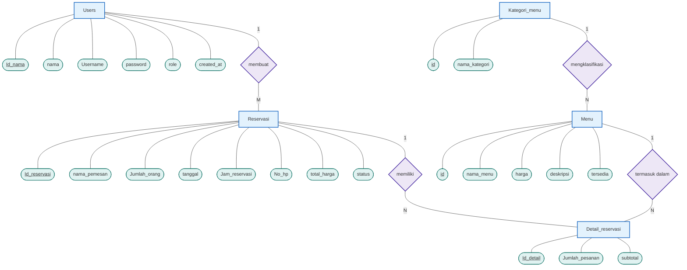

# ERD Klasik — Sistem Reservasi Restoran

Entity Relationship Diagram (ERD) bergaya klasik menggunakan **Chen Notation** dengan simbol: entitas (persegi panjang), atribut (elips/oval), relasi (berlian), dan kardinalitas (1, M, N).

---

## Diagram ERD Klasik

---

## Struktur Entitas

### 1. Tabel `users`

| Kolom | Tipe Data | Keterangan |
|---|---|---|
| `Id_nama` *(PK)* | INT, AUTO_INCREMENT | Primary Key |
| `nama` | VARCHAR(100) | Nama lengkap pengguna |
| `Username` | VARCHAR(100), UNIQUE | Username untuk login |
| `password` | VARCHAR(100) | Password terenkripsi |
| `role` | ENUM('member','admin') | Peran pengguna, default 'member' |
| `created_at` | TIMESTAMP | Waktu pembuatan akun |

---

### 2. Tabel `kategori_menu`

| Kolom | Tipe Data | Keterangan |
|---|---|---|
| `id` *(PK)* | INT, AUTO_INCREMENT | Primary Key |
| `nama_kategori` | VARCHAR(50) | Nama jenis kategori menu |

---

### 3. Tabel `menu`

| Kolom | Tipe Data | Keterangan |
|---|---|---|
| `id` *(PK)* | INT, AUTO_INCREMENT | Primary Key |
| `nama_menu` | VARCHAR(100) | Nama makanan / minuman |
| `Kategori_id` *(FK)* | INT(11) | Foreign Key ke kategori_menu.id |
| `harga` | INT(11) | Harga produk |
| `deskripsi` | TEXT | Deskripsi item menu |
| `tersedia` | TINYINT(1) | Ketersediaan produk (1 = tersedia) |

---

### 4. Tabel `reservasi`

| Kolom | Tipe Data | Keterangan |
|---|---|---|
| `Id_reservasi` *(PK)* | INT | Primary Key |
| `User_id` *(FK)* | INT(11) | Foreign Key ke users.Id_nama |
| `nama_pemesan` | VARCHAR(100) | Nama pelanggan pemesan |
| `No_hp` | INT(11) | Nomor handphone pemesan |
| `Jumlah_orang` | INT, DEFAULT 1 | Jumlah orang yang datang |
| `total_harga` | INT | Total harga keseluruhan |
| `tanggal` | DATE | Tanggal reservasi kunjungan |
| `Jam_reservasi` | TIME | Jam reservasi |
| `status` | ENUM | baru / diproses / selesai / dibatalkan |

---

### 5. Tabel `detail_reservasi`

| Kolom | Tipe Data | Keterangan |
|---|---|---|
| `Id_detail` *(PK)* | INT, AUTO_INCREMENT | Primary Key |
| `Id_reservasi` *(FK)* | INT(11) | Foreign Key ke reservasi.Id_reservasi |
| `Id_menu` *(FK)* | INT(11) | Foreign Key ke menu.id |
| `Jumlah_pesanan` | INT(11) | Jumlah item yang dipesan |
| `subtotal` | DECIMAL(10,2) | Total harga per item pesanan |

---

## Relasi Antar Entitas

| Relasi | Entitas Asal | Kardinalitas | Entitas Tujuan | Keterangan |
|---|---|---|---|---|
| membuat | `users` | **1 : M** | `reservasi` | Satu user membuat banyak reservasi |
| mengklasifikasi | `kategori_menu` | **1 : N** | `menu` | Satu kategori mencakup banyak menu |
| memiliki | `reservasi` | **1 : N** | `detail_reservasi` | Satu reservasi memiliki banyak detail |
| termasuk dalam | `menu` | **1 : N** | `detail_reservasi` | Satu menu muncul di banyak detail reservasi |

---

## Simbol ERD yang Digunakan

| Simbol | Sintaks Mermaid | Keterangan |
|---|---|---|
| Entitas | `Nama[Nama]` | Persegi panjang |
| Relasi | `Nama{Nama}` | Belah ketupat / berlian |
| Atribut | `Nama([Nama])` | Oval / elips |
| Atribut PK | `Nama([<u>Nama</u>])` | Oval dengan garis bawah |
| Kardinalitas | `---|1|`, `---|M|`, `---|N|` | Label pada garis penghubung |
