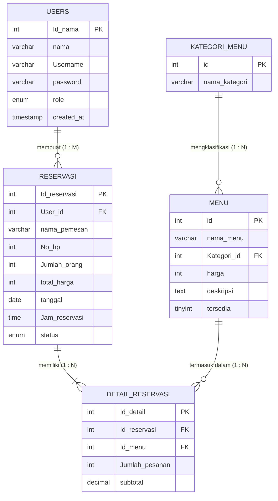

# ERD Klasik — Sistem Reservasi Restoran

Entity Relationship Diagram (ERD) bergaya klasik untuk sistem manajemen reservasi restoran menggunakan **Chen Notation** dengan simbol utama: entitas (persegi panjang), atribut (elips), relasi (berlian), dan kardinalitas (1, M, N).

---

## Daftar Isi

- [Gambaran Umum](#gambaran-umum)
- [Diagram ERD Klasik](#diagram-erd-klasik)
- [Struktur Entitas](#struktur-entitas)
- [Relasi Antar Entitas](#relasi-antar-entitas)
- [Simbol ERD yang Digunakan](#simbol-erd-yang-digunakan)

---

## Gambaran Umum

Sistem ini dirancang untuk mengelola proses reservasi meja di restoran, mencakup:

- Manajemen **pengguna** (admin dan member)
- Pengelolaan **menu** berdasarkan kategori
- Pencatatan **reservasi** oleh pelanggan
- Detail pesanan menu per reservasi melalui **detail_reservasi**

---

## Diagram ERD Klasik

> Diagram ERD menggunakan **Chen Notation** dengan kardinalitas `1`, `M`, dan `N` pada setiap garis relasi.

---

## Struktur Entitas

### 1. Tabel `users`

Menyimpan data pengguna sistem (admin maupun member).

| Kolom | Tipe Data | Keterangan |
|---|---|---|
| `Id_nama` *(PK)* | INT, AUTO_INCREMENT | Primary Key |
| `nama` | VARCHAR(100) | Nama lengkap pengguna |
| `Username` | VARCHAR(100), UNIQUE | Username untuk login |
| `password` | VARCHAR(100) | Password terenkripsi |
| `role` | ENUM('member','admin') | Peran pengguna, default 'member' |
| `created_at` | TIMESTAMP | Waktu pembuatan akun |

---

### 2. Tabel `kategori_menu`

Menyimpan jenis atau kategori dari menu yang tersedia.

| Kolom | Tipe Data | Keterangan |
|---|---|---|
| `id` *(PK)* | INT, AUTO_INCREMENT | Primary Key |
| `nama_kategori` | VARCHAR(50) | Nama jenis kategori menu |

---

### 3. Tabel `menu`

Menyimpan daftar makanan dan minuman yang ditawarkan restoran.

| Kolom | Tipe Data | Keterangan |
|---|---|---|
| `id` *(PK)* | INT, AUTO_INCREMENT | Primary Key |
| `nama_menu` | VARCHAR(100) | Nama makanan / minuman |
| `Kategori_id` *(FK)* | INT(11) | Foreign Key → `kategori_menu.id` |
| `harga` | INT(11) | Harga produk |
| `deskripsi` | TEXT | Deskripsi item menu |
| `tersedia` | TINYINT(1) | Ketersediaan produk (1 = tersedia) |

---

### 4. Tabel `reservasi`

Menyimpan data reservasi yang dibuat oleh pelanggan.

| Kolom | Tipe Data | Keterangan |
|---|---|---|
| `Id_reservasi` *(PK)* | INT | Primary Key |
| `User_id` *(FK)* | INT(11) | Foreign Key → `users.Id_nama` |
| `nama_pemesan` | VARCHAR(100) | Nama pelanggan pemesan |
| `No_hp` | INT(11) | Nomor handphone pemesan |
| `Jumlah_orang` | INT, DEFAULT 1 | Jumlah orang yang datang |
| `total_harga` | INT | Total harga keseluruhan |
| `tanggal` | DATE | Tanggal reservasi kunjungan |
| `Jam_reservasi` | TIME | Jam reservasi |
| `status` | ENUM | baru / diproses / selesai / dibatalkan |

---

### 5. Tabel `detail_reservasi`

Menyimpan detail item menu yang dipesan dalam satu reservasi.

| Kolom | Tipe Data | Keterangan |
|---|---|---|
| `Id_detail` *(PK)* | INT, AUTO_INCREMENT | Primary Key |
| `Id_reservasi` *(FK)* | INT(11) | Foreign Key → `reservasi.Id_reservasi` |
| `Id_menu` *(FK)* | INT(11) | Foreign Key → `menu.id` |
| `Jumlah_pesanan` | INT(11) | Jumlah item yang dipesan |
| `subtotal` | DECIMAL(10,2) | Total harga per item pesanan |

---

## Relasi Antar Entitas

| Relasi | Entitas Asal | Kardinalitas | Entitas Tujuan | Keterangan |
|---|---|---|---|---|
| membuat | `users` | **1 : M** | `reservasi` | Satu user dapat membuat banyak reservasi |
| memiliki | `reservasi` | **1 : N** | `detail_reservasi` | Satu reservasi memiliki banyak detail pesanan |
| termasuk dalam | `menu` | **1 : N** | `detail_reservasi` | Satu menu dapat muncul di banyak detail reservasi |
| mengklasifikasi | `kategori_menu` | **1 : N** | `menu` | Satu kategori mencakup banyak item menu |

---

## Simbol ERD yang Digunakan

| Simbol | Bentuk | Notasi Mermaid | Fungsi |
|---|---|---|---|
| Entitas | Persegi panjang `□` | Nama tabel dalam blok `{}` | Objek utama dalam sistem |
| Atribut PK | Elips garis bawah `<u>attr</u>` | Suffix `PK` pada kolom | Menandai Primary Key |
| Atribut FK | Elips biasa | Suffix `FK` pada kolom | Menandai Foreign Key |
| Relasi | Belah ketupat `◇` | Label pada garis relasi | Nama hubungan antar entitas |
| Kardinalitas 1:1 | `\|\|──\|\|` | `\|\|--\|\|` | Satu ke satu |
| Kardinalitas 1:M | `\|\|──<{` | `\|\|--o{` | Satu ke banyak (opsional) |
| Kardinalitas 1:N | `\|\|──{\|` | `\|\|--\|{` | Satu ke banyak (wajib ada) |
